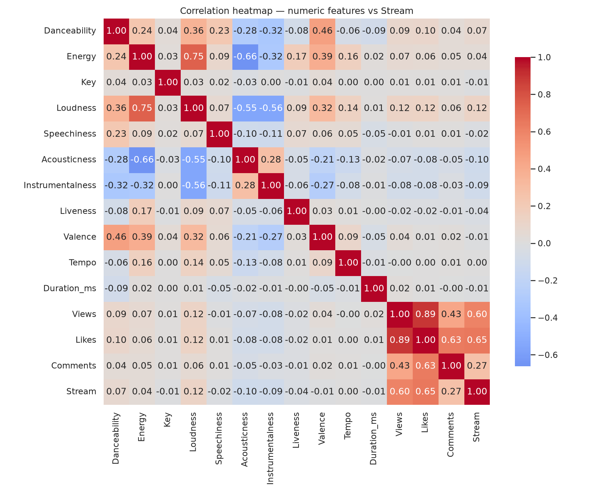
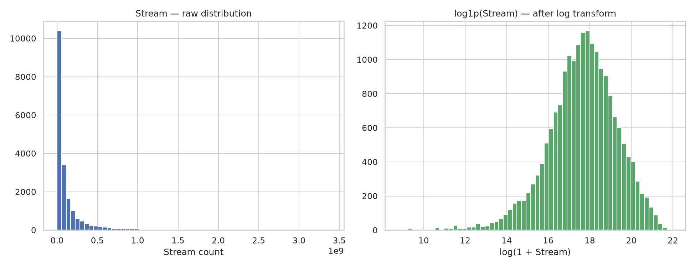

# Linear Regression Model — Orange Economy Ghana

## Mission
Ghana's creative sector (especially music) has real export potential, but individual artists struggle to turn their craft into a sustainable income. This project predicts a track's likely Spotify stream count from its audio characteristics and its YouTube video's engagement — using real numbers once a song is live, or target numbers to plan promotion effort beforehand — giving artists and producers a practical, data-backed read on what drives streaming success. **Dataset:** [Spotify and YouTube](https://www.kaggle.com/datasets/salvatorerastelli/spotify-and-youtube) (Kaggle) — 20,718 tracks from 2,074 artists, combining Spotify audio features with YouTube engagement metrics.

**Scope note:** the model's strongest predictors (YouTube Views/Likes/Comments) are engagement metrics, so this is a *post-release trajectory / promotion-planning* tool, not a pre-release hit predictor — it's most useful once a track and its video are live (plug in real numbers to gauge potential), or beforehand with target numbers to plan how much promotion effort a given streaming goal requires.

### Where to get the input values

- **YouTube Views / Likes / Comments:** use the real numbers from the track's official video once it's live, or a **target** you're planning toward, to see what payoff that promotion goal would translate to in predicted streams.
- **Tempo, Duration, Loudness:** measurable directly from your own mix/master in any DAW (BPM, track length, and a loudness meter reading are all things you already know about your own track).
- **Key:** enter it as a number using standard pitch-class numbering — see the table below.
- **Danceability, Energy, Speechiness, Acousticness, Instrumentalness, Liveness, Valence:** these were originally sourced from Spotify's own audio-analysis, but **Spotify deprecated public access to its `audio-features`/`audio-analysis` endpoints for new developer apps on 2024-11-27** ([official announcement](https://developer.spotify.com/blog/2024-11-27-changes-to-the-web-api)), so they can no longer be pulled from Spotify directly for a new track. In practice, approximate these using **[Tunebat's Analyzer](https://tunebat.com/Analyzer)** — search an existing Spotify track by name/link, or upload your own audio file directly for a new, unreleased song — or a careful self-estimate. These are third-party ML estimates, not Spotify's exact proprietary numbers, but should be directionally close enough to explore how a production choice shifts the prediction.

### Key numbering (pitch class)

| Key | # | Key | # |
|---|---|---|---|
| C | 0 | F♯/G♭ | 6 |
| C♯/D♭ | 1 | G | 7 |
| D | 2 | G♯/A♭ | 8 |
| D♯/E♭ | 3 | A | 9 |
| E | 4 | A♯/B♭ | 10 |
| F | 5 | B | 11 |

Key has almost no relationship with streaming success in this data (correlation ≈ -0.006 — essentially none) — average streams range from ~155M (C♯/D♭) down to ~119M (A) across the 20,718 tracks, but that ~30% spread is most likely noise or a proxy for genre, not a real effect of the key itself. It's included for completeness, but don't expect changing it to meaningfully move a prediction.

## Live API (Swagger UI)
**https://linear-regression-model-4z71.onrender.com/docs**

The service is on Render's free tier, so the first request after a period of inactivity may take 30-60 seconds to wake up.

## Video demo
**https://youtu.be/OcCzNy30HJs**

## Key visualizations (see the notebook for full interpretation)

**Correlation heatmap** — YouTube `Likes` (0.65) and `Views` (0.60) are by far the strongest predictors of `Stream`; among audio features, `Loudness` (+0.12) is strongest while `Acousticness`/`Instrumentalness` are mildly negative.



**Stream distribution, before/after log transform** — raw stream counts are extremely right-skewed (skew ≈ 4.1); a `log1p` transform (applied to `Stream`, `Views`, `Likes`, `Comments`) brings that down to ≈ -0.6, which is what makes linear regression viable here.



Two more plots (a views-vs-streams scatter/album-type boxplot, and the SGD gradient-descent loss curve) are generated in the notebook and saved alongside it.

## Repo structure
```
linear_regression_model/
├── summative/
│   ├── linear_regression/
│   │   ├── multivariate.ipynb   # EDA, feature engineering, model training/comparison
│   │   ├── data/                # dataset (Spotify_Youtube.csv)
│   │   └── models/              # saved best model + scaler + feature columns
│   ├── API/
│   │   ├── main.py               # FastAPI app (CORS, Pydantic validation, /predict, /retrain)
│   │   ├── prediction.py         # loads the saved model, makes a prediction (Task 1 -> Task 2 handoff)
│   │   ├── pipeline.py           # shared feature-engineering + training logic
│   │   └── requirements.txt
│   ├── FlutterApp/                # mobile app (streaming_predictor)
│   └── pyproject.toml             # uv-managed environment for the notebook/API
```

## Running the notebook / API locally

This project uses [uv](https://docs.astral.sh/uv/) for Python package management.

```bash
cd summative
uv sync                                   # installs all dependencies from pyproject.toml/uv.lock
uv run jupyter lab linear_regression/multivariate.ipynb   # open the notebook

# Run the API locally:
cd API
uv run --project .. uvicorn main:app --reload
# Swagger UI at http://127.0.0.1:8000/docs
```

## Running the mobile app

The app is a single Flutter page (`summative/FlutterApp`) that calls the live Render API — no local backend needed.

```bash
cd summative/FlutterApp
flutter pub get
flutter run -d chrome        # or: flutter run  (with a connected Android/iOS device or emulator)
```

Fill in all 17 fields (grouped into Audio characteristics, YouTube engagement, and Release details, each with inline guidance on what the value means and where to find it) and tap **Predict** to get the track's predicted Spotify stream count, along with a plain-language read of where that falls relative to the training data (e.g. "breakout hit — top 25%").

## Retraining with new data
`POST /retrain` on the API accepts a CSV upload (same columns as `Spotify_Youtube.csv`), appends it to the existing dataset, retrains and re-compares all four models (OLS linear regression, SGD/gradient-descent linear regression, Decision Tree, Random Forest), and hot-swaps the served model to whichever wins — no server restart required.
